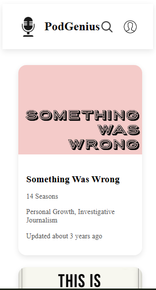
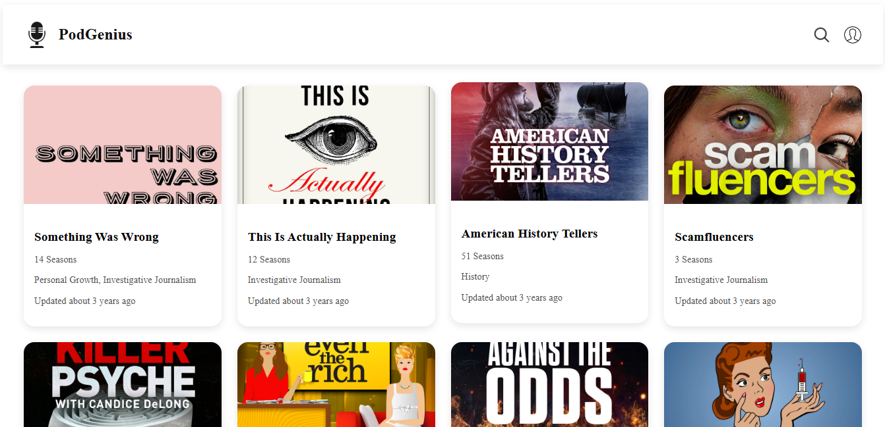

# 🎙️ PodGenius

An awesome **React podcast app** that fetches and displays podcasts with key info like title, seasons, genres, and last updated date. Includes loading and error states for smooth UX.

---

## 🌟 Features

- Fetches podcast data from a public API
- Displays podcasts in a responsive grid
- Podcast cards show title, seasons, genres, and updated date
- Loading spinner while fetching data
- Error handling with user-friendly messages
- Interactive header with logo, search, and profile icons

---

## ⚡ Technologies Used

- **React**
- **CSS3**
- **Fetch API for HTTP requests**
- **date-fns for formatting dates**

---

## 🛠️ Setup Instructions

1. **Clone the repository**

```bash
git clone https://github.com/Lindokuhle-dumakude/LINDUM25535_FTO2506_GroupB_Lindokuhle_Dumakude_DJS03.git
cd LINDUM25535_FTO2506_GroupB_Lindokuhle_Dumakude_DJS03
```

2. **Install dependencies**

```bash
npm install
```

3. **Start the development server**

```bash
npm run dev
```

4. **Open the app**

Navigate to http://localhost:5173 in your browser

---

## 🚀 Usage Examples





---
